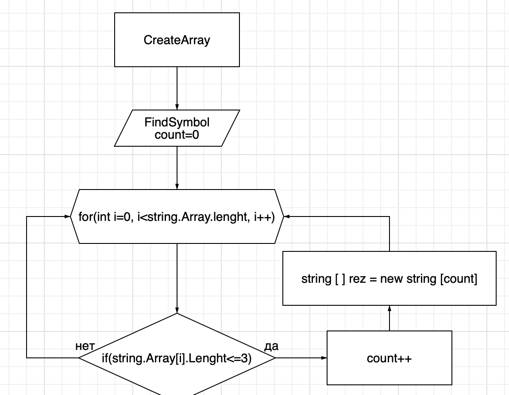

# Итоговая контрольная работа по основному блоку
## Задание:

1. Создать репозиторий на GitHub
2. Нарисовать блок-схему алгоритма.
3. Снабдить репозиторий оформленным текстовым описанием решения (файл README.md).
4. Написать программу, решающую поставленную задачу.
5. Использовать контроль версий в работе над этим проектом.

  Написать программу, которая из имеющегося массива строк формирует новый массив из строк, длина которых меньше, либо равна 3 символам. Первоначальный массив можно ввести с клавиатуры, либо задать на старте выполнения алгоритма. При решении не рекомендуется пользоваться коллекциями, лучше обойтись исключительно массивами.

## Решение:

Создаем поля для ввода данных, объявляем два массива, одинаковой длины. Создаем метод с циклом соразмерный длине массива, внутри цикла проверка условия ( <=3 ), если да элемент первого массива заносится в count элемента второго массива. Переменная count необходима чтобы поочередно перемещать из первого массива во второй. После присвоения переменная count увеличивается на 1 и возвращается к циклу for в котором i увеличивается на 1. Проверяется весь массив. Далее вывод результата.

### Блок схема:
